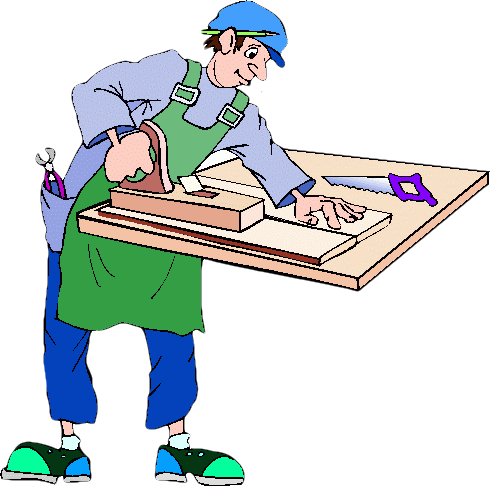
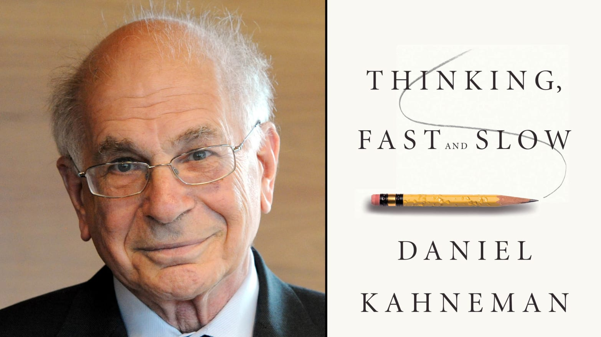
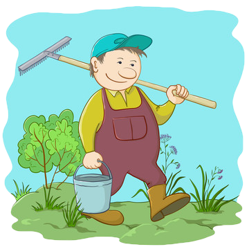

layout: true

---
## 研究者和教育者

--

- 研究者

--

  - 是什么 ？

--

  - 为什么 ？

--

- 教育者

--

  - 做什么 ？

--

  - 怎么做 ？

---
## 目的

--

- 生存

--

- 适应

--

- 改变

---
## 现实

--

- 多样

--

- 多变

--

- 迅速

--

- 不可预测

---
## 生存

--

- 超强适应：石头、植物、动物

--

- 动物世界：生理健壮

--

- 人类？

---
## 人类生存

--

- 文化进化

--

- 超长儿童期

--

- 个体差异

---
## 一些事实

--

- 儿童期个体的差异：基因、环境、交互作用。

--

- 儿童的大脑更适合探索，而成人的大脑更适合钻研。

--

- 社会结构：一夫一妻、隔代照顾、共同照顾等。

---
## 养育的历史

--

- 动物

--

- 智人（Homo Sapiens）

--

- 父母（Mother、Father）

---
## 木匠观的兴起

--

- 社会变迁（20世纪）：家庭结构变小、人口流动、结婚和生育年龄变晚等

--

- 大家庭提供的自然观察学习消失

--

- 养育（Parents、Parenting）：1958年在美国出现，上世纪70年代开始流行

---
layout: false
class: center, middle

---
layout: true

---
## 木匠观的兴起

--

- 父母和孩子就像木匠和家具。

--

- 木匠首先根据木料材质和客户需求绘制家具草图。

--

- 然后根据草图利用各种工具制作家具。

--

- 木匠工作好坏取决于家具质量好坏。

---
## 育儿学和营养学

--

- 经验变成了专长、生活变成了工作。

--

- 养育：育儿学

--

- 饮食：营养学

---
## 营养学和育儿学

--

- 营养学流行，伴随的是人类营养状况的变差

--

- 育儿学流行，伴随的是人类儿童幸福感的缺失。

---
## 木匠观的问题

--

- 毫无疑问，对孩子的照料、养育、和付出对于家庭和人类繁荣都至关重要。

--

- 木匠观的问题在于：从进化论和现实情况来看，有意识把孩子培养成某种样子往往无效且事与愿违。

--

- 就算孩子能按我们的意愿长大，也不见得是好事；因为我们无法预知孩子将来面对的挑战。

---
## 木匠观的问题

--

- 把孩子按我们想象的或当下理想的画面进行培养，实际上降低了他们将来应付变化的能力。

--

- 就算某模式在过去合适，并造就了我们的成功，我们依旧没有理由相信该模式将继续保证下一代的成功。

--

- 很多在过去导致人类成功的适应性变化，在当下环境中往往是无用甚至是有害的，例如对糖和脂肪的偏好。

---
## 木匠观的问题

--

- 但在当下环境下，人类的核心适应能力，即 “对变化本身的适应”，却变得比任何时候都重要。

--

- 这种灵活性学习、根据环境做出调整、改变社会结构的能力等都比以前更加重要了。

--

- 与此同时，亲子关系依旧是解决这些挑战的关键，但木匠观却不是。

---
## 木匠观的问题：个体差异

--

- 大胆和胆小

--

- 集中和分散注意

---
layout: false
class: center, middle
background-image: url("pics/Paper-Folding.png")
background-position: center
background-size: contain

--

对折 51 次？

--

厚度会超过地球到太阳的距离 !!

???
##  有限理性

- 地球到太阳的距离: 149597870 千米;
- 一张纸的厚度: 0.1 毫米;
- 2 的 50 次方: $2^{50}$ = 1125899906842624;
- 折叠 50 次后的纸张: 0.1 毫米 $\times 2^{50}$ = 112589990 千米;
- 折叠 50 次后纸张厚度是地球到太阳距离的 ** 58% **!!
- 折叠 51 次后,厚度会超过地球到太阳的距离!!

---
layout: false
## 有限理性

---
layout: true

---
## 养育的目的

--

- 亲情矛盾：依赖和独立（支持和放弃）、吾幼和他幼

--

- 学习矛盾：探索和钻研（游戏和工作）、传统和创新

---
layout: false
class: center, middle

---
layout: true

---
## 园丁观

--

- 养育孩子就像照料一个花园，成为父母就像成为一个园丁。

--

- 园丁要在花园提供安全、肥沃的空间，使花朵有机会绽放。

--

- 园丁需要付出大量汗水和劳动，但花朵却不一定按园丁的想法生长。

--

- 花朵们超出控制、茁壮成长、开花绽放，正是园丁工作的独特魅力所在。

---
## 园丁观

--

- 花园中植物种群的多样性是花园活力和适应性的基础。

--

- 每个孩子都有其独特的脾气秉性和人格，对其独特性的无条件尊重是社会多样性发展的基础。

--

- 无论孩子是胆小还是胆大，开朗还是内向，是桃树还是杏树，我们都要喜欢他。

--

- 养育不是培养某类特定的成年人，而是使孩子更茁壮、更具适应性、有可重塑性，以适应将来不可避免或不可预测的变化。

---
## 园丁观

--

- 人类发展中，每一代都会在上一代形成的稳定态中加入一点改变，产生新的可能性。

--

- 下一代将要创造的新世界或者新秩序，我们这一代或许永远无法想象和预测。

--

- 父母要为儿童提供一个丰富、安全、稳定的保护空间（实际和比喻）。

--

- 这种安全环境将保证各种不可预知的不同儿童都能得到绽放。

---
## 园丁观

--

- 安全环境还让每个孩子在进入钻研阶段前有机会进行探索、学习、弄的一团糟、并让某些不合适自然地消亡。

--

- 父母不要去试图塑造儿童的思想，而是创造条件让儿童探索世界允许的所有可能性。

--

- 养育一个孩子不是帮助他制定目标，而是在其成长过程中为其提供必要的支持。

--

- 父母不是让孩子学习，而是给孩子机会学习。

--

- 游戏时，父母的任务不是告诉儿童如何玩耍，而是在游戏前拿出玩具，在游戏后收起玩具。

---
## 园丁观

--

- 木匠观以前儿童探索和游戏的世界和成人钻研和工作的世界是一致的，那片森林、那个村子、那块农场、或者那个厨房。

--

- 随着当今社会的飞速发展，这种一致性逐渐消失了。

--

- 教养焦虑的出现实际上是伴随着街道、公共空间、邻里、甚至是某些私密空间的减少而出现的。

---
## 一些建议

--

- 通过观察学习：身教胜于言传

--

- 通过聆听学习：让他自己发现

---
## 通过观察学习：身教胜于言传

--

- 育儿手册通常会制定一系列行为，告诉父母与孩子在一起时应做什么。

--

- 但是如果父母平时根本不做这些事情，而只有与在孩子一起时才做，那么这种教养是无效的。

--

- 儿童通过观察父母的行为学习，他们会仔细听父母们说什么，仔细看父母们做什么。

--

- 儿童会按你的实际行为方式去做，会按你想做的方式做，或按你觉得最合理的方式去做。

---
## 通过观察学习：身教胜于言传

--

- 教育孩子，先改变自己：“不按我做的来，而是按我说的来” 是一种无效的教养方式。

--

- 正确的教养方式是与孩子 “一起动手”、一起经历，一起参与到这个世界，认识到彼此的长处和短处。

--

- 这种共同经历可以是工作、饲养、散步、做饭，或其他任何一种行为。

---
## 通过聆听学习：让他自己发现

--

- 听孩子说，跟孩子说，问孩子并回答孩子的“为什么”，将有助于他们的绽放。

--

- 父母不用过多地去“教”孩子，而是给孩子机会让他们学习；

--

- 父母用有意地控制他们跟儿童说的话，给儿童提供的信息。事实上，儿童学习过程是如此敏感和细微，有意控制大多时候是无效的。

---
## 通过聆听学习：让他自己发现

--

- 给儿童机会，近距离观察不同人的行为模式是帮助他们观察学习的最好方式。

--

- 给儿童机会，让他们跟不同的人说话，是帮助他们进行倾听学习的最好方式。

---
## 青少年的长成

--

- 伊甸园和失乐园

--

- 青少年：K12 是从探索到钻研的转化期

---
## 总结：养育是一种爱

--

- 养育不是一种“工作”，而是一种关系，“爱”。

--

- 爱也有目的的，但目的却不是为其发展绘制蓝图。

--

- 爱不是去改变所爱之人，而是为其绽放提供支持。

--

- 爱不是为其制定目标，而是协助其找到自己的目标。

--

- 爱不是为其指明道路，而是协助其找到自己的路，

--

- 无我们自己（帮他）会不会选择这条路。

---
## 附录

- "0 岁~6 岁儿童发育行为评估量表" (中华人民共和国卫生行业标准) [下载](http://www.gxcdc.com/uploadfile/2018/0705/20180705031611697.pdf)

- 智商量表